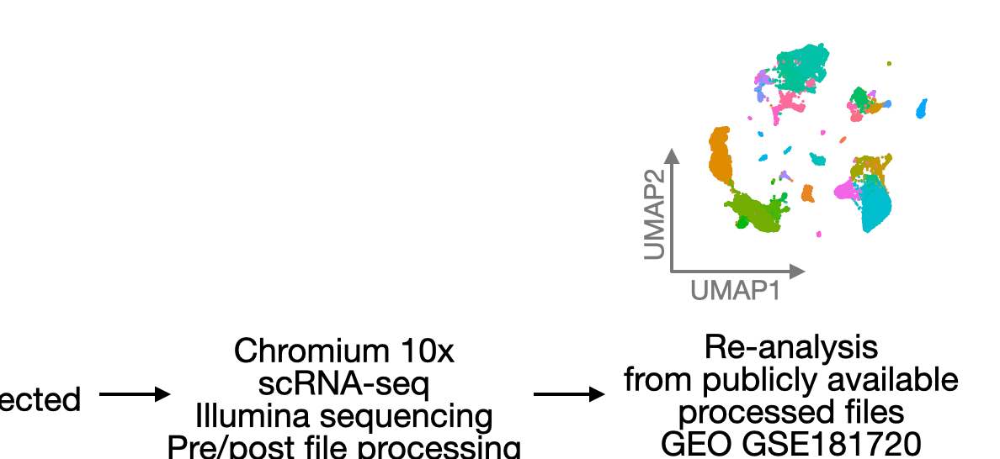

# In vivo transcriptional analysis of mice infected with Leishmania major unveils cellular heterogeneity and altered transcriptomic profiling at single-cell resolution

> This is the R code associated with my re-analyses of the single-cell RNA-seq dataset from Venugopal G. et al, 2021 published at PLOS NTD.

<p>[DOI LINK](https://doi.org/10.1371/journal.pntd.0010518)</p>

## Abstract (copied from manuscript)
Leishmania parasites cause cutaneous leishmaniasis (CL), a disease characterized by disfiguring, ulcerative skin lesions. Both parasite and host gene expression following infection with various Leishmania species has been investigated in vitro, but global transcriptional analysis following L. major infection in vivo is lacking. Thus, we conducted a comprehensive transcriptomic profiling study combining bulk RNA sequencing (RNA-Seq) and single-cell RNA sequencing (scRNA-Seq) to identify global changes in gene expression in vivo following L. major infection. Bulk RNA-Seq analysis revealed that host immune response pathways like the antigen processing and presentation pathway were significantly enriched amongst differentially expressed genes (DEGs) upon infection, while ribosomal pathways were significantly downregulated in infected mice compared to naive controls. scRNA-Seq analyses revealed cellular heterogeneity including distinct resident and recruited cell types in the skin following murine L. major infection. Within the individual immune cell types, several DEGs indicative of many interferon induced GTPases and antigen presentation molecules were significantly enhanced in the infected ears including macrophages, resident macrophages, and inflammatory monocytes. Ingenuity Pathway Analysis of scRNA-Seq data indicated the antigen presentation pathway was increased with infection, while EIF2 signaling is the top downregulated pathway followed by eIF4/p70S6k and mTOR signaling in multiple cell types including macrophages, blood and lymphatic endothelial cells. Altogether, this transcriptomic profile highlights known recruitment of myeloid cells to lesions and recognizes a potential role for EIF2 signaling in murine L. major infection in vivo. 

These analyses are also available as a shiny app, using the ShinyCell R package: https://amorimc.shinyapps.io/lmajor_scrnaseq/



```